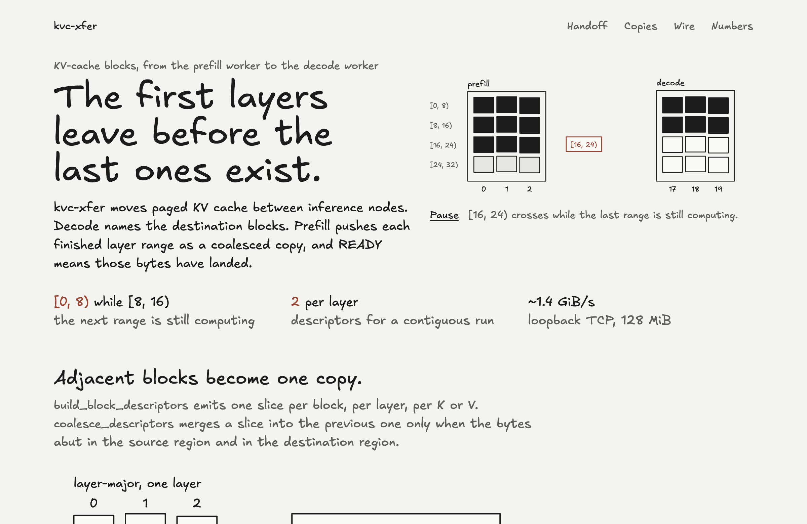

# kvc-xfer

`kvc-xfer` moves paged KV-cache blocks between LLM inference nodes so that
prefill and decode can run on different machines (or different workers on the
same machine). It is a C++20 library with no dependencies beyond the standard
library and POSIX sockets.

The handoff, with each layer range crossing while the next one is still
computing, is at <https://jvkec.github.io/kvc-xfer/>.

[](https://jvkec.github.io/kvc-xfer/)

```
 prefill node                                        decode node
 ┌──────────────────────┐                            ┌──────────────────────┐
 │ scheduler / model    │                            │ scheduler / model    │
 │        │ publish()   │                            │      expect()  │     │
 │  ┌─────▼──────────┐  │   PREPARE / READY / ABORT  │  ┌─────────────▼───┐ │
 │  │   KvHandoff    │◄─┼────────────────────────────┼─►│   KvHandoff     │ │
 │  └─────┬──────────┘  │                            │  └─────────────┬───┘ │
 │  ┌─────▼──────────┐  │                            │  ┌─────────────▼───┐ │
 │  │ TransferEngine │  │  blocks → coalesced copies │  │ TransferEngine  │ │
 │  └─────┬──────────┘  │                            │  └─────────────┬───┘ │
 │  ┌─────▼──────────┐  │   WRITE / READ / NOTIFY    │  ┌─────────────▼───┐ │
 │  │   Transport    │◄─┼════════════════════════════┼─►│   Transport     │ │
 │  └────────────────┘  │  (tcp today; rdma/nvlink   │  └─────────────────┘ │
 │   KV cache region    │   are pluggable)           │   KV cache region    │
 └──────────────────────┘                            └──────────────────────┘
```

## What it does

| Layer | Header | Responsibility |
|---|---|---|
| `KvLayout` | `kvc/layout.hpp` | Geometry of a paged KV cache (layers, heads, head_dim, block size, dtype, arrangement). Computes byte offsets and turns block lists into **coalesced** copy descriptors. |
| `MemoryRegistry` | `kvc/memory.hpp` | Registered memory regions addressable by peers via a `RegionId`. |
| `Transport` | `kvc/transport.hpp` | Data plane: `write` (push), `read` (pull), `notify` (ordered control message). Two implementations ship: `TcpTransport` and `LocalTransport` (in-process memcpy). |
| `TransferEngine` | `kvc/engine.hpp` | Block-level API: `push_blocks` / `pull_blocks` with layer ranges, per-peer layouts, timeouts, metrics. |
| `KvHandoff` | `kvc/handoff.hpp` | Prefill→decode protocol: consumer announces destination blocks (`PREPARE`), producer pushes and signals (`READY`), either side can `ABORT`. Supports layer-wise pipelining. |
| `Metrics` | `kvc/metrics.hpp` | Lock-free counters and latency histogram. |

Key properties:

- **Zero intermediate copies on the TCP path.** Payload bytes are scattered
  from and gathered into registered regions with `sendmsg`/`recv`; only
  frame headers are allocated per transfer.
- **Coalescing.** Adjacent blocks in the same layer collapse into one
  descriptor; block-major caches transfer a whole block range as one segment.
- **Both orderings of the handoff work.** `publish()` before the consumer's
  `PREPARE` is queued; `expect()` before prefill finishes is the normal path.
- **Layer-wise pipelining.** Publish `[0,8)`, then `[8,16)`, … as layers
  finish; the decode side fires once its whole expected range has landed.
- **Failures are explicit.** Every transfer completes with a `Status`:
  `NotFound` (region), `OutOfRange` (bounds), `Disconnected`, `Timeout`,
  `Cancelled`, `ProtocolError`. Remote validation errors are relayed back.

## Quick start

```cpp
#include "kvc/kvc.hpp"
using namespace kvc;

KvLayout layout{.num_layers = 32, .num_kv_heads = 8, .head_dim = 128,
                .block_size = 16, .num_blocks = 4096, .dtype = DType::kBF16,
                .arrangement = KvArrangement::kLayerMajor};

// ---- decode node ----
auto decode_tx = std::make_shared<TcpTransport>(
    TcpTransportConfig{.self = "decode-0", .bind_host = "0.0.0.0", .bind_port = 7000});
TransferEngine decode({"decode-0", layout}, decode_tx);
decode.start();
RegionId decode_region = *decode.register_kv_cache(kv_ptr, kv_bytes);
KvHandoff consumer(decode);

// scheduler admits a request and allocates its blocks:
consumer.expect("req-42", "prefill-0", decode_region, {17, 18, 19},
                [](const std::string& id, const Status& s, uint64_t bytes) {
                  if (s.ok()) start_decoding(id);
                });

// ---- prefill node ----
auto prefill_tx = std::make_shared<TcpTransport>(TcpTransportConfig{.self = "prefill-0"});
TransferEngine prefill({"prefill-0", layout}, prefill_tx);
prefill.start();
RegionId prefill_region = *prefill.register_kv_cache(kv_ptr, kv_bytes);
prefill.connect("decode-0", {"10.0.0.7", 7000});
KvHandoff producer(prefill);

// after prefill computes layers [0, 16) and [16, 32):
producer.publish("req-42", "decode-0", prefill_region, {0, 1, 2}, LayerRange::of(0, 16));
auto h = producer.publish("req-42", "decode-0", prefill_region, {0, 1, 2}, LayerRange::of(16, 32));
h.wait();  // bytes landed on decode-0 and READY was sent
```

`examples/pd_demo.cpp` is a runnable version of this on loopback.

If the decode node's cache differs in `num_blocks` or `arrangement`, tell the
prefill engine with `prefill.set_peer_layout("decode-0", decode_layout)`; the
handoff verifies layout fingerprints and refuses mismatches.

## Building and testing

Requirements: CMake ≥ 3.20, a C++20 compiler (Apple clang 15+, GCC 12+,
Clang 15+), Linux or macOS. GoogleTest is found via `find_package` or fetched.

```sh
cmake -S . -B build -G Ninja -DCMAKE_BUILD_TYPE=Release
cmake --build build
ctest --test-dir build -j8          # 71 tests
./build/pd_demo                     # prefill→decode demo on loopback
./build/kvc_bench --help            # loopback throughput benchmark
```

Options: `-DKVC_SANITIZE=ON` (ASan+UBSan), `-DKVC_WERROR=ON`,
`-DKVC_BUILD_TESTS=OFF`, `-DKVC_BUILD_TOOLS=OFF`. The suite is clean under
AddressSanitizer, UndefinedBehaviorSanitizer, and ThreadSanitizer.

### Benchmark (Apple M-series, loopback, one connection, 128 MiB per transfer)

| transport | mode | throughput |
|---|---|---|
| tcp | push, layer-major | ~1.4 GiB/s |
| tcp | pull | ~1.4 GiB/s |
| local (memcpy) | push | ~44 GiB/s |

Loopback TCP is bounded by the kernel's socket path, not by this library; on
real NICs use one `TcpTransport` per NIC queue or add an RDMA transport (see
`docs/design.md`).

## Repository layout

```
include/kvc/   public headers (kvc.hpp is the umbrella)
src/           implementation
tests/         GoogleTest suites (layout, protocol, memory, transfer, transports, engine, handoff)
tools/         kvc_bench
examples/      pd_demo
docs/          design.md (architecture, threading, extension points), protocol.md (wire format)
```

## Current limitations

- Transports address **host memory** only. `MemoryKind::kDevice` is part of
  the API so a CUDA/RDMA transport can be added without changing callers.
- One TCP connection per peer pair; there is no striping across connections.
- A KV cache is one contiguous region per node. Per-layer allocations can be
  registered as separate regions and driven with `push_raw`/`pull_raw`.
- Heterogeneous tensor parallelism (re-sharding KV heads between nodes) is not
  handled; both sides must agree on `num_kv_heads`.
